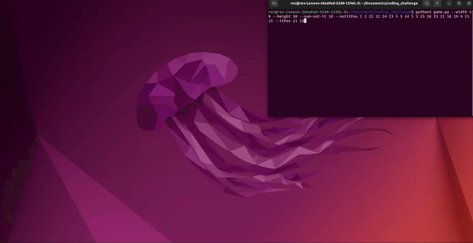

# Freezetag Game

A multi-agent game simulation where an "IT" agent tries to catch "NotIT" agents in a grid-based environment.



## Overview

This project implements a classic game of Freezetag using a distributed node-based architecture with LCM (Lightweight Communications and Marshalling) for inter-process communication. The game features:

- An "IT" agent that pursues other agents
- Multiple "NotIT" agents that try to avoid being caught
- A graphical interface showing agent movements in real-time
- Publish/subscribe messaging system for agent communication
- Multi-process execution for concurrent agent behavior

## Requirements

- Python 3.6 or higher
- Dependencies listed in `requirements.txt`:
  ```
  lcm>=1.5.0
  numpy>=1.20.0
  tkinter
  uuid
  multiprocessing
  argparse
  ```

> **Note:** `tkinter`, `uuid`, `multiprocessing`, and `argparse` are part of the Python standard library.

## Installation and Setup

### Step 1: Check Python Installation

First, check if Python is already installed:

```bash
python3 --version  # Linux/macOS
python --version   # Windows
```

If Python 3.6+ is already installed, you can skip to Step 3. If not, proceed to Step 2.

### Step 2: Install Python (if needed)

#### Ubuntu/Debian
```bash
sudo apt update
sudo apt install python3 python3-pip python3-dev python3-tk
```

#### macOS
```bash
brew install python3
```

#### Windows
**Important Note for Windows Users:** LCM doesn't work well on Windows directly. We recommend using Windows Subsystem for Linux (WSL) with Ubuntu 22.04:

1. Install WSL with Ubuntu 22.04:
   ```
   wsl --install -d Ubuntu-22.04
   ```
2. Follow the Ubuntu installation instructions within your WSL environment.

If you must use native Windows:
- Download the installer from [python.org](https://www.python.org/downloads/)
- Run the installer
- ✅ Check "Add Python to PATH"
- ✅ Check "Install pip"

### Step 3: Install System Dependencies for LCM

#### Ubuntu/Debian (and WSL)
```bash
sudo apt install build-essential libglib2.0-dev
```

#### macOS
```bash
brew install glib
```

### Step 4: Set up Virtual Environment (Recommended)

```bash
# Linux/macOS/WSL
python3 -m pip install virtualenv
python3 -m venv freezetag_env
source freezetag_env/bin/activate

# Windows (if not using WSL)
pip install virtualenv
python -m venv freezetag_env
freezetag_env\Scripts\activate
```

### Step 5: Install Dependencies

```bash
pip install -r requirements.txt
```

## Project Structure

- `game.py`: Main game controller that manages the simulation
- `node.py`: Base class for all agents implementing the node architecture
- `itagent.py`: Implementation of the IT agent behavior
- `notitagent.py`: Implementation of the NotIT agent behavior
- `messages.py`: LCM message definitions for agent communication
- `requirements.txt`: List of Python dependencies

## Running the Game

```bash
# Linux/macOS/WSL
python3 game.py --width 50 --height 50 --num-not-it 3 --notitPos 10 10 20 20 30 30 --itPos 40 40 --debug

# Windows (if not using WSL)
python game.py --width 50 --height 50 --num-not-it 3 --notitPos 10 10 20 20 30 30 --itPos 40 40 --debug
```

### Command Line Arguments

- `--width`: Width of the game board (required)
- `--height`: Height of the game board (required)
- `--num-not-it`: Number of NotIT agents (required)
- `--notitPos`: Positions of NotIT agents as space-separated x y coordinates (required)
- `--itPos`: Position of IT agent as x y coordinates (required)
- `--debug`: Enable debug mode to print additional information (optional)

## Game Rules

1. The IT agent (green) tries to catch the NotIT agents (red)
2. When a NotIT agent is caught, it freezes and turns blue
3. The game ends when all NotIT agents are frozen
4. Agents can only move one cell at a time in the grid

## Architecture

The game uses a distributed architecture where:
- Each agent runs in its own process
- Agents communicate via LCM publish/subscribe messaging
- The main game controller monitors agent positions and manages game state
- A tkinter GUI displays the current game state

## OS-Specific Notes

### Ubuntu/Debian
- If you encounter display issues, ensure you're running with a valid display server
- For headless servers, you might need an X server setup

### macOS
- If you see "Tcl/Tk" issues, run: `brew install python-tk`
- For Apple Silicon Macs, you might need to use Rosetta for some libraries

### Windows
- **Recommended approach:** Use WSL with Ubuntu 22.04
- If using WSL, you may need an X server like VcXsrv to display the GUI
- If attempting native Windows installation, LCM may be unstable and require additional configuration

## Troubleshooting

### Common Issues

- **Python Version Issues**
  - This project requires Python 3.6+
  - Check your version with `python --version` or `python3 --version`
  - If you have multiple Python versions, use the appropriate command (`python3` or `py -3`)

- **LCM Installation Problems**
  - Ubuntu/Debian: `sudo apt install build-essential libglib2.0-dev`
  - macOS: `brew install glib`
  - Windows: We strongly recommend using WSL instead of native Windows for LCM

- **GUI Does Not Display**
  - Verify tkinter is installed: `python -m tkinter`
  - Ubuntu/Debian: `sudo apt install python3-tk`
  - macOS: `brew install python-tk`
  - WSL: Install an X server on Windows and export DISPLAY (e.g., `export DISPLAY=:0`)

- **Agents Not Moving**
  - Enable debug mode to see process status: `--debug`
  - Check if processes are being terminated prematurely
  - Verify LCM communication is working

- **Game Crashes on Startup**
  - Check validity of command line arguments
  - Ensure positions are within board dimensions
  - Verify all required files are present

## Extending the Game

To add new agent behaviors or game mechanics:
1. Create a new class that extends the Node base class
2. Implement the required methods: `on_start()`, `run()`, and `on_stop()`
3. Subscribe to relevant LCM topics and publish updates
4. Initialize the new agent in the Game class

## License

[Your License Information]
